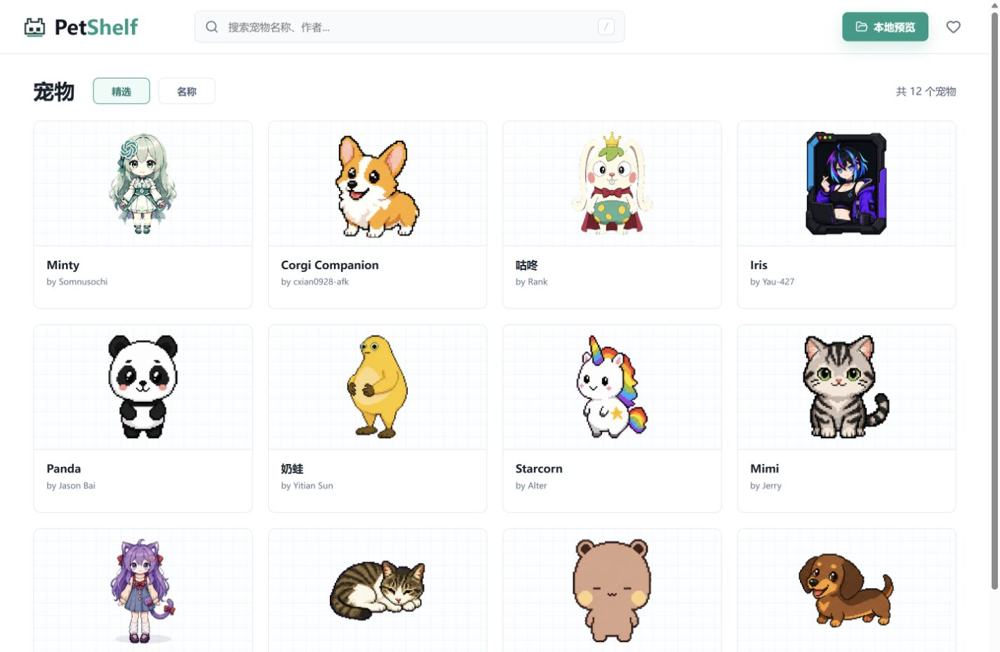
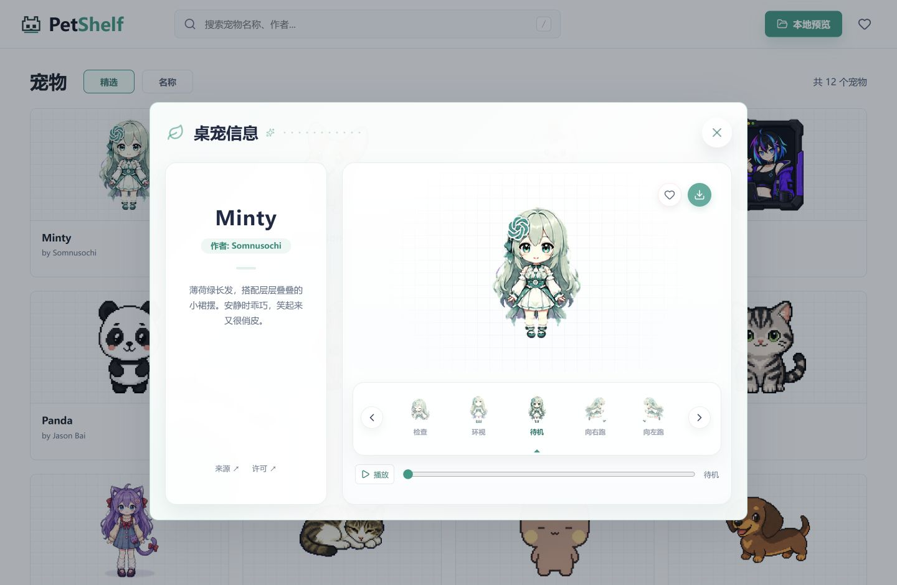

# PetShelf

一个轻量桌宠陈列架，使用 React + Vite 构建。支持浏览搜索、收藏、动画预览和宠物包下载。

## 预览





[本地文件夹预览](docs/screenshots/03-local-preview.png) · [手机端](docs/screenshots/04-mobile-detail.png)

## 运行

```sh
npm install
npm run dev
```

当前为静态 Demo，无需登录或数据库；收藏保存在浏览器。支持 V1 / V2 图集及本地文件夹预览。

测试：`npm test` · 构建：`npm run build` · 预览构建：`npm run preview`

## 素材

12 个宠物来自 [Awesome Codex Pet](https://github.com/legeling/awesome-codex-pet)，保留原作者署名与各自的 MIT / CC BY 4.0 许可。详见 [素材目录](public/pets/community) 和 [验证记录](docs/demo-verification.md)。
